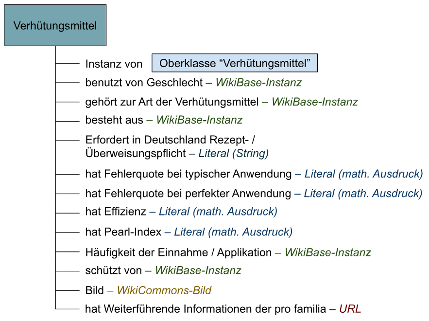
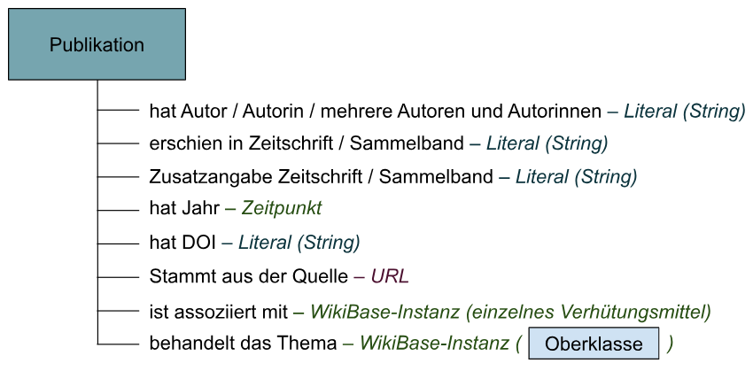
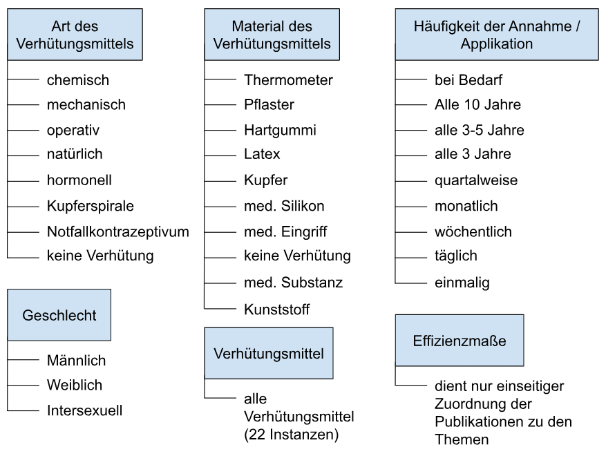
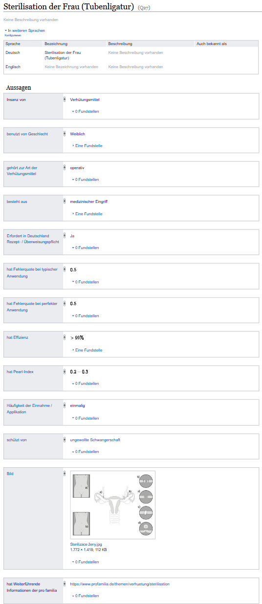
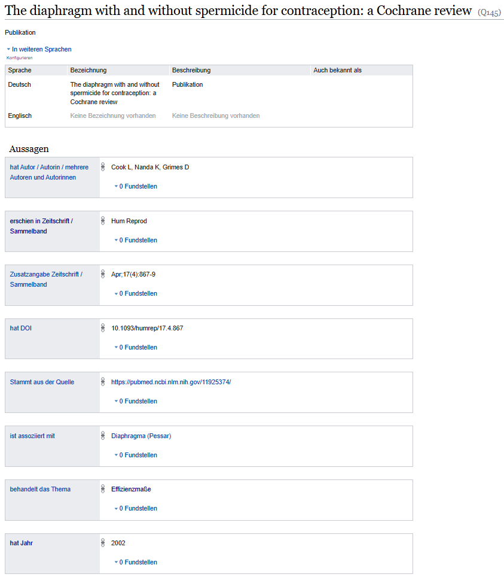

# WikiBase "Verhütungsmittel und ihre Eigenschaften"

Die WikiBase "Verhütungsmittel und ihre Eigenschaften" verfolgt das Ziel, eine einheitliche Übersicht über Verhütungsmittel in deutscher Sprache bereitzustellen. Es enthält Informationen über ihre Effizienz in verschiedenen Maßen (z. B. Pearl-Index, Fehlerquote oder Effizienz), ihre Kategorien, die Materialien, aus denen sie bestehen, die Häufigkeit ihrer Einnahme bzw. Applikation sowie ihre Rezept- oder Überweisungspflicht in Deutschland. Zudem wird angegeben, ob sie neben einer ungewollten Schwangerschaft auch vor sexuell übertragbaren Infektionen schützen. Jede Aussage ist mit entsprechenden medizinischen Publikationen verknüpft, die über das Portal PubMed abgerufen werden können.

In diesem Repositorium werden Dateien mit Informationen zu den Verhütungsmitteln, Metadaten der Publikationen sowie Python-Skripte abgelegt. Diese Skripte automatisieren das Erstellen der WikiBase-Entitäten und QuickStatements zum Hochladen der Aussagen über diese.

## WikiBase

**Verhütungsmittel und ihre Eigenschaften**  
[Zur WikiBase](https://verhuetungsmittel-eigenschaften.wikibase.cloud/wiki/Main_Page)

Datenmodelle für die WikiBase:

Beispielhafte Darstellung der Information zu einem Verhütungsmittel:

Beispielhafte Darstellung der Metadaten einer Publikation:

## Inhalt

- Projektbeschreibng
- Lizenz (CC-BY-SA) s. hier: https://creativecommons.org/licenses/by-sa/4.0/deed.de
- "contraception_data.csv"
CSV-Datei mit den Verhütungsmitteln und zugehörigen Informationen. Enthält neben den Verhütungsmitteln samt ihrer Beschreibungen folgende Informationen:
    - Geschlecht, für das das Verhütungsmittel geeignet ist
    - Art des Verhütungsmittels
    - Materialien, aus denen das Verhütungsmittel besteht
    - Rezept-/Überweisungspflicht in Deutschland
    - Fehlerquote bei typischer Anwendung
    - Fehlerquote bei perfekter Anwendung
    - Effizienz
    - Pearl-Index
    - Häufigkeit der Einnahme/Applikation
    - Schutz vor Schwangerschaft und/oder sexuell übertragbaren Infektionen
    - Bildquelle (WikiMedia Commons)
    - Link zu weiterführenden Informationen von pro familia
Enthält insgesamt 22 Verhütungsmittel.
- "publications_data.csv"
CSV-Datei mit medizinischen Publikationen und ihren Metadaten. Enthält neben den Titeln der Publikationen folgende Informationen:
    - Autor*in
    - Zeitschrift/Sammelband, in dem die Publikation erschienen ist
    - Zusatzangaben zur Zeitschrift/Sammelband
    - Erscheinungsjahr
    - DOI
    - Keywords
    - Verlinkungen zu relevanten Verhütungsmitteln 
    - Verlinkungen zur thematisch passenden Oberklasse
Enthält insgesamt 165 Publikationen.
- "publications_data.csv"
CSV-Datei mit Properties, deren Beschreibungen und den zugehörigen WikiBase-Datentypen.
- "create_properties.py"
Python-Skript zum Erstellen der Properties in der WikiBase.
- "load_entities.py"
Python-Skript zum Erstellen der Entitäten in der WikiBase basierend auf den Daten zu Verhütungsmitteln, Publikationen und Oberklassen.
- "quickstatements_print.py"
Python-Skript zur Erstellung von QuickStatements, mit denen Aussagen über Verhütungsmittel, Publikationen und deren Verknüpfungen erzeugt werden.
- "quickstatements.txt"
Ausgabedatei mit den generierten QuickStatements.

## Hinweise

Hinweise auf Fehler und mögliche Verbesserungsvorschläge, sowie Anfragen zur Kollaboration nehme ich mit Dankbarkeit auf!

Zitierabgabe: Arazyan, Nune: WikiBase "Verhütungsmittel und ihre Eigenschaften", Online: 11.03.2025, https://github.com/nunearazyan/verhuetungsmittel-eigenschaften